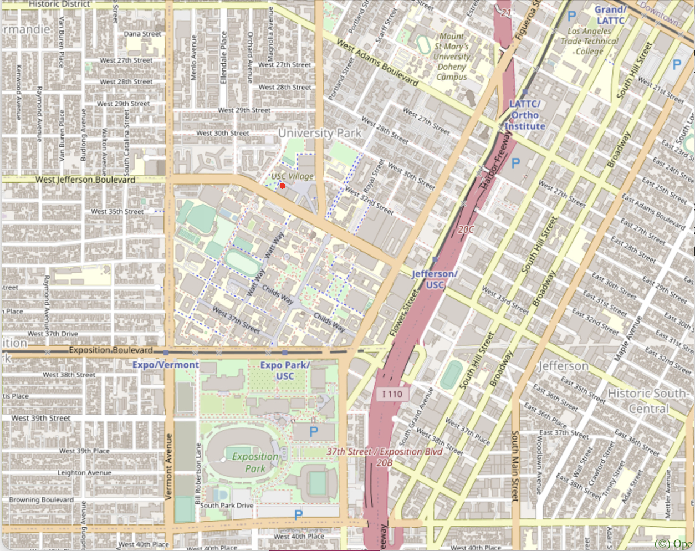
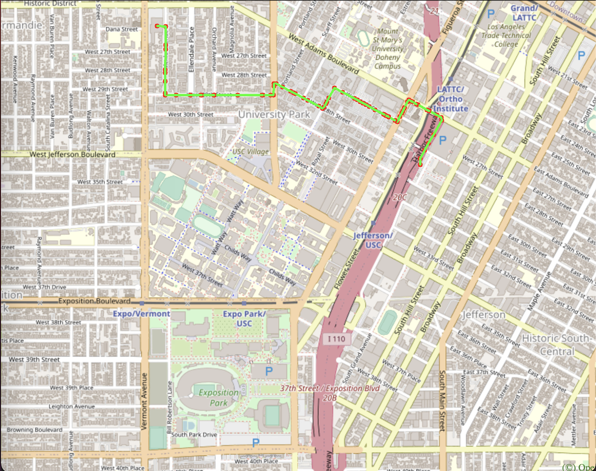
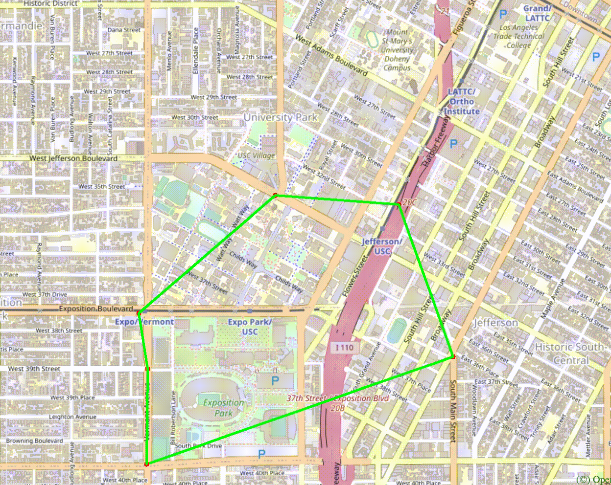
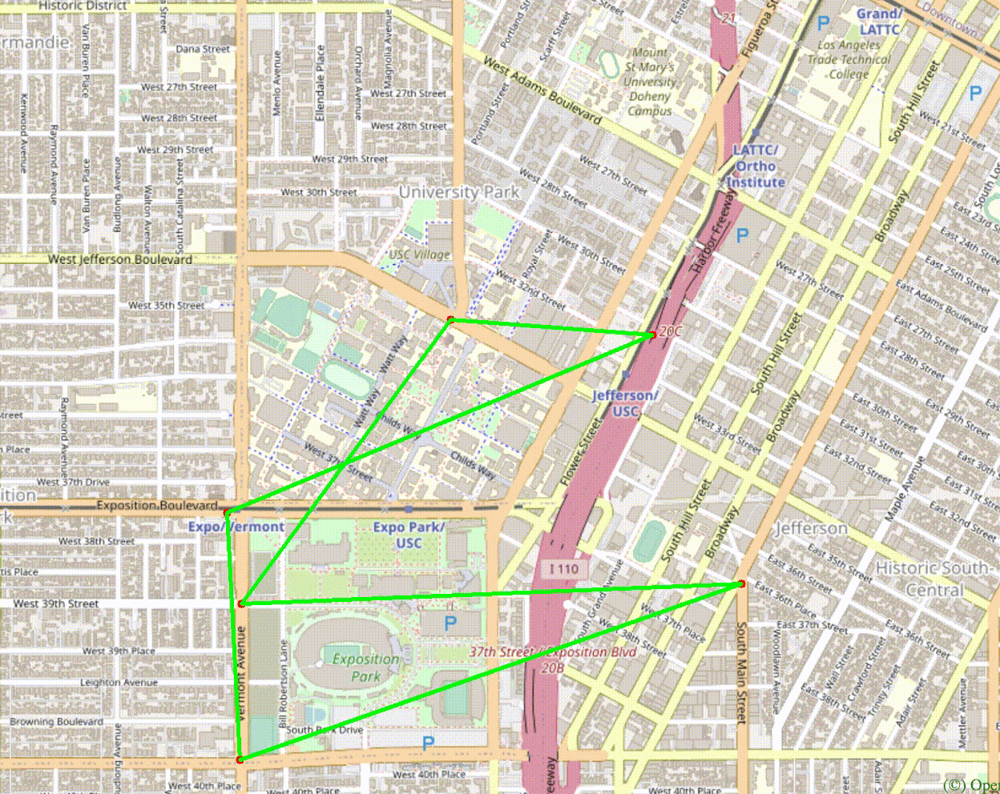
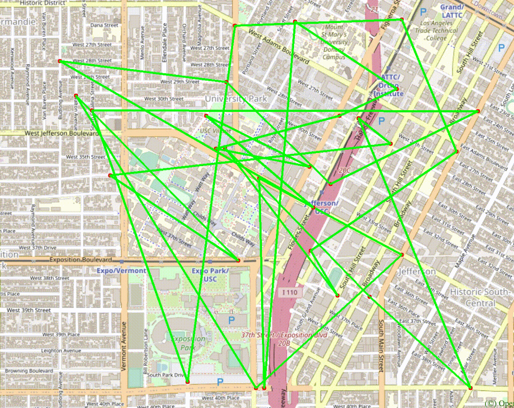

# EE599 Final Project - TrojanMap

## TrojanMap Overview

In this project, we solve four main problem to mimic the function on goolge map. The project focuses on using data structures and graph search algorithms to build a mapping application. User can use this project to complete:

- Type the prefix (ignoring cases) and return all possible location names.
- Inserting a location and get the latitude and longitude.
- Find the shortest path between two locations and return the path on the map.
- Solve the travling salesman problem with random locations, and return an animated plot.

For visualizations we use OpenCV library. The area will be around USC. The map is shown below:

<p align="center"></p>

---

## The data Structure

Each point on the map is represented by the class **Node** shown below and defined in [trojanmap.h](src/lib/trojanmap.h).

```cpp
class Node {
  public:
    std::string id; // A unique id assign to each point
    double lat;     // Latitude
    double lon;     // Longitude
    std::string name; // Name of the location. E.g. "Bank of America".
    std::vector<std::string> neighbors; // List of the ids of all neighbor points.
};
```
---
## Step 1: Autocomplete the location name

```c++
std::vector<std::string> Autocomplete(std::string name);
```
> We consider the names of nodes as the locations. Implement a method to type the partial name of the location and return a list of possible locations with partial name as prefix.

In this function we trun all input into lower case,

```c++
  std::transform(name.begin(), name.end(), name.begin(), ::tolower);  
```
Then, compare to each name included in our dataset by using `substr(0,sizeOfPrefix)`.
The function will return all possible loactions in a list.

```c++
std::vector<std::string> Autocomplete(std::string name);
```
#### Time complexity: *O(n^2)*
> We get O(*prefixSize*) when we turn the prefix into lowercase, then we compare to each word in the dataset which cost *O(dataSize * prefixSize)*. Thus, we get *O(n^2)* time complexity.

```shell
1
**************************************************************
* 1. Autocomplete
**************************************************************

Please input a partial location:us
*************************Results******************************
USC Fisher Museum of Art
USC Village Gym
USC Parking
USC Village Dining Hall
**************************************************************
```
---

## Step 2: Find the place

```c++
std::pair<double, double> GetPosition(std::string name);
```

> Given a location name, return the latitude and longitude. There is no duplicate location name. Mark the location on the map. If the location does not exists, return (-1, -1).

```c++
void SaveLocName();
```
To get the position of the locaiton name, we need to get the name's id. Therefore, we need to build a hash table with the relationship between name and id. We called `name_id`.
#### Time Complextiy: *O(n)*, We iterate whole data to build `name_id`. Thus, it took *O(dataSize)*

```c++
std::pair<double, double> GetPosition(std::string name);
```
After we build the relationship between name and id, we can get the position by this hash table in constant time.
#### Time Complexity: *O(Constant)*

Example:

Input: "USC Village Gym" \
Output: (34.0252392,-118.2858186)

```shell
2
**************************************************************
* 2. Find the position
**************************************************************

Please input a location:USC Village Gym
*************************Results******************************
Latitude: 34.0252 Longitude: -118.286
**************************************************************
```

<p align="center"></p>

---

## Step 3: CalculateShortestPath

```c++
std::vector<std::string> CalculateShortestPath(std::string location1_name, std::string location2_name);
```
> Given 2 locations A and B, find the best route from A to B. The distance between 2 points is the euclidean distance using latitude and longitude.

In this problem, we implement two algorithms to get the shortest path./
- Dijkstra
- Bellman Ford

### Dijkstra

***Dijkstra*** is a Greedy algorithm, which alway choose the smallest distance in each iteration. At the end of the iteration, we can get the shortest distance between starting location and all of the oter location node. Dijktra algorithm cannot handle negative weight, which do not exist in the map. Thus, we can apply Dijkstra algorithm in this problem./

```c++
 std::vector<std::string> CalculateShortestPath(std::string location1_name, std::string location2_name);
```
We implement Dijkstra algorithms in above function. Here is the detail of this function:

1. First, we need to declare our data structure:

```c++
std::vector<std::string> path; // the shortest path
std::unordered_map<std::string, bool> visited; // remember which node we have visited aready
std::unordered_map<std::string, double> dis; // storage the distance between starting location and each node
std::unordered_map<std::string, std::string> parent; // rememeber the node's parent.
```
2. Second, we will set up the distance which conect with the starting location.
```c++
double CalculateDistance(const Node &a, const Node &b);
```
3. Third, we start our @@iterations (iterate whole dataset):
      Find the shortest distance in table `dis` by `findMinDistanceButNotVisited()` function, which we get the next loction will be `curr_id`. The time complextiy will be *O(dataSize)*.
```c++
 std::string findMinDistanceButNotVisited(std::unordered_map<std::string, double>& d, std::unordered_map<std::string, bool>& visited);
```
Iterate all `curr_id` neighbors, if the distance between `curr_id` and it's neighbor + current distance is shorter than previous, we updata the table, and save neighbor location's parent as `curr_id`.

4. After the whole iteration, we will complete the `std::unordered_map<std::string, double> dis` table, which give us the shortest distance between starting loction and each node in the dataset.

To print out the path between input A to B location, we need to use:

```c++
 void printPath(std::string target, std::unordered_map<std::string, std::string>& parent, std::vector<std::string>& path);
```
We backtrack the End location to start loction by there parent. The time complexity will be the path length.

#### The total time complexity: *O(n^2)*

> Improvement: If we save the distance in a heap data struture, the time complexity can be improve to *O(nlogn)*.

Example:

Input: "Los Angeles", "Ralphs"\
Output: [ "368173251","7360424709","269636456","1614922683","1614922687","1614922692","1614922696",           "544348509","544348510","2193435055","63785522","4011837232","4835551074","4835551066","4835551070","6813565322","123241961","6813565326","4012842277","4835551064","5556117115","5556117120","20400292","6813513564","6813513563","122659187","7863689395","4835551084","2613117900","7863656075","7863689388","6807580191","6787803674","6787803666","6787803661","6787803658","6787803653","6787803649","6816822864","122659191","2613117891","6813379507","6985903602","6813416161","122814440","7200139036","7882624618","6813416166","6807536642","6807320427","6807536647","6813416171","6813416123","122814447","6813416159","6813405266","123178871","2613117906","2613156405","6807243572","6813405267","6987230634","6987230635","123178876","6816193783","6389467806","6816193784","6813405269","6816831441","6808093919","6808093913","6808093910","6787470571","5559640911","2578244375"]

```shell
3
**************************************************************
* 3. CalculateShortestPath
**************************************************************
*************************Results******************************
368173251
7360424709
269636456
1614922683

...

6787470571
5559640911
2578244375
**************************************************************
```

<p align="center"></p>

### Bellman Ford

***Bellman Ford*** algorithm is also a Greedy approach. Different from Dijkstra algorithm, we updata the distance table for every node in each iteration. Untill no more update we break out the loop and get the finaly result. In our problem, the distance between each node will not be negative. However, Bellman Ford algorithms can handle negative weights.

```c++
std::vector<std::string> CalculateShortestPathBellman(std::string location1_name, std::string location2_name);
```
We implement Bellman Ford algorithms in above function. Here is the detail of this function:

1. First, we need to declare the our data structure: (simlar with Dijkstra)
```c++
std::vector<std::string> path;
std::unordered_map<std::string, bool> visited;
std::unordered_map<std::string,double> distance;
std::unordered_map<std::string,std::string> parent;
std::vector<std::pair<double, std::pair<std::string,std::string>>> each_dis; // save the distance between two locations
```
2, Second, we intialize above data structure, it is same as Dijsktra in this step.
3. Third, we start the iteration:
```
  for 1 to (data Size -1):
    for all data:
      if previous distance(start point to i location) is larger than current distance + current location:
          update the distance
    if no update, break the loop
```
4. Use the same technique as dijkstra, tracks back the parent to get the path.

#### Time Complexity: *O(n^2)*
The worst case will be O((data.size - 1)* data size), however, if there is no update the function will end faster.

---
## Step 4: The Travelling Trojan Problem (AKA Traveling salesman!)

> In this section, we are going to solve the Traveling Salesman Problem. The input will be a vector with k random locations. We need to find out the best route to travel all location and return back to the starting location. We can assume every location can reach every location in the list (Complete graph. Do not care the neighbors).

```c++
std::pair<double, std::vector<std::vector<std::string>>> TravellingTrojan(
      std::vector<std::string> &location_ids);
```

### Brute Force Method
```c++
std::pair<double, std::vector<std::vector<std::string>>> TravellingTrojan(
      std::vector<std::string> &location_ids);
```
In brute force method, we can try all possible route to travel all locations, then compare the distance between each route and find the smallest distance path.

We use backtracking(dfs) approach to find all permutation, and get the best traveling path.

#### Time Complexity: *O(n!)*

Improvement: we can stop the recursion if the distance is larger than the previous distance. It will not improve ploynomial run time. However, It save a lot of time.

```shell
4
**************************************************************
* 4. Travelling salesman problem                              
**************************************************************

In this task, we will select N random points on the map and you need to find the path to travel these points and back to the start point.

Please input the number of the places:10
Calculating ...
*************************Results******************************
5618016860
4343588867
269633656
6813379442
6805827703
6815190429
5618016860
**************************************************************
The distance of the path is:3.09011
**************************************************************
You could find your animation at src/lib/output.avi
```

Best Route | Animation
-----------|----------
 | 

### 2-opt Heuristic

```c++
std::pair<double, std::vector<std::vector<std::string>>> TravellingTrojan2_opt(std::vector<std::string> &location_ids);
```
In 2-opt Heuristic, we can get the result way much faster than brute force approach. The main idea of 2-opt approach is to remove the crossing routes to find a better solution. We try to swap the node and see if there is an improvement. When there is no improvement, we will break out the loop.

This is the function to swap the to distance: 
```c++
std::vector<std::string> twoNodeSwap(int i, int j, std::vector<std::string>& path);
```

> However, 2-opt is an heuristic approach, we cannot get the best result every time. We can just get the local minmimum result. 

```shell
Try the same node in brute force method.
The distance of the path is:4.52257
we get the same result !!
```
Best Route | Animation
-----------|----------
 | 

> Here we try 30 locations for opt-2 approach:

<p align="center"></p>

<p align="center"></p>

---
## Conclusion
In this project, we implement different algorthims to get the shortest path and Travel Salesman Problem. The problems are mostly focus on graph search problem. We use the data structue which extract from [map.csv](src/lib/map.csv), and compare with different algorithm's performance and property. Moreover, we also implenment heuristic algortims which might not get the best result, but it can save lots of run time.  

---
## Teammate: Liang-Chun Chen, Po Yu Yang

---
### OpenCV Installation

For visualizations we use OpenCV library. You will use this library as a black box and don't need to worry about the graphic details.

**Notice**: Installing this library may take a long time. This is only for visualization. You can still start coding even without installing this library and visualization.

Use the following commands to install OpenCV.

```shell
cd TrojanMap
git clone https://github.com/opencv/opencv.git
cd opencv/
mkdir build install
cd build
```

For Ubuntu,
```shell
sudo apt-get install cmake libgtk2.0-dev pkg-config
sudo apt install libcanberra-gtk-module libcanberra-gtk3-module
```

For MacOS,
```shell
brew install cmake
```

Next, type the following, but make sure that you set the **path_to_install_folder** to be the absolute path to the install folder under opencv.

```shell
cmake -D CMAKE_INSTALL_PREFIX=**path_to_install_folder** -D BUILD_LIST=core,highgui,imgcodecs,imgproc,videoio  -D WITH_TBB=ON -D WITH_OPENMP=ON -D WITH_IPP=ON -D CMAKE_BUILD_TYPE=RELEASE -D BUILD_EXAMPLES=OFF -D WITH_NVCUVID=ON -D WITH_CUDA=ON -D BUILD_DOCS=OFF -D BUILD_PERF_TESTS=OFF -D BUILD_TESTS=OFF -D WITH_CSTRIPES=ON -D WITH_OPENCL=ON ..
make install
```

For example, if cloned this repo under "/Users/ari/github/TrojanMap", you should type:

```shell
cmake -D CMAKE_INSTALL_PREFIX=/Users/ari/github/TrojanMap/opencv/install  -D BUILD_LIST=core,highgui,imgcodecs,imgproc,videoio  -D WITH_TBB=ON -D WITH_OPENMP=ON -D WITH_IPP=ON -D CMAKE_BUILD_TYPE=RELEASE -D BUILD_EXAMPLES=OFF -D WITH_NVCUVID=ON -D WITH_CUDA=ON -D BUILD_DOCS=OFF -D BUILD_PERF_TESTS=OFF -D BUILD_TESTS=OFF -D WITH_CSTRIPES=ON -D WITH_OPENCL=ON ..
make install
```

---
## Run the program

Please run:

```shell
bazel run src/main:main
```

If everything is correct, this menu will show up.

```shell
**************************************************************
* Select the function you want to execute.
* 1. Autocomplete
* 2. Find the position
* 3. CalculateShortestPath
* 4. Traveling salesman problem
* 5. Exit
**************************************************************
```
---
## Test the program

We create some tests for you to test your program, please run
```shell
bazel test tests:tests:trojanmap_test
```

Please add you test in the [trojanmap_test_student.cc](tests/trojanmap_test_student.cc) and run

```shell
bazel test tests:trojanmap_test_student
```
